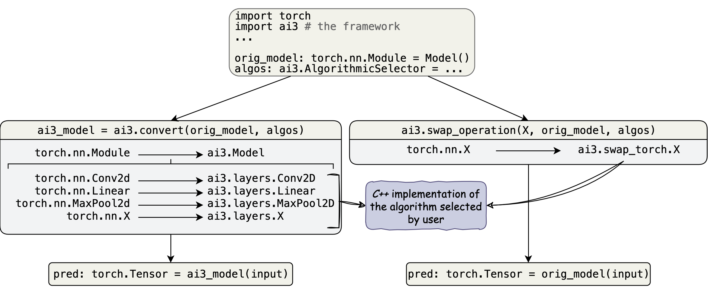

|name|
======

The |name| (Algorithmic Innovations for Accelerated Implementations of
Artificial Intelligence) framework provides easy-to-use fine-grain algorithmic
control over an existing *DNN*. |name| contains built-in
:ref:`high performance <performance>` implementations of common deep learning
operations and methods by which users can implement their own algorithms in
*C++*. |name| incurs no additional performance overhead, meaning that
performance depends solely on the algorithms chosen by the user.

|doc|_ |repo|_

Framework Overview [#f1]_
"""""""""""""""""""""""""

.. include:: home_footnotes

Installation
""""""""""""
**Built-In Implementations**
  1. Wheel: *pip install* |pkg_name|
  2. From Source (improves acceleration platform finding): *pip install* |pkg_name| *--no-binary :all:*

**Custom Implementations**
  1. Download the source code
  2. Create an implementation with the operations defined in |custom|_
  3. If needed, configure the build process with |custom_cmake|_
  4. ``pip install <path to source code>``
