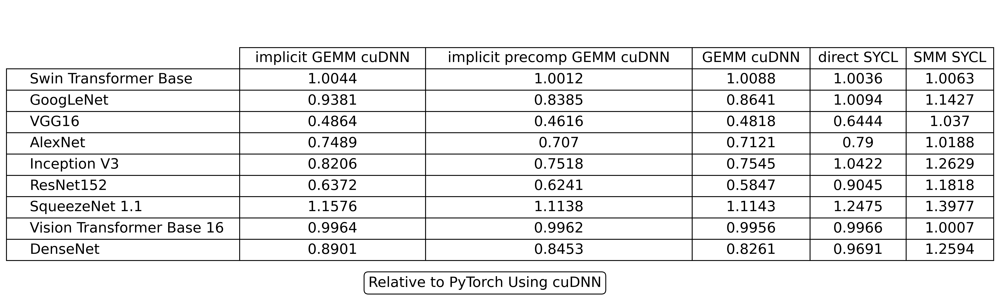

.. _performance:

Performance
"""""""""""
.. figure:: _static/conv2d_times.png
   :alt: Latencies of Convolution Operation
   :align: center
   :width: 80%
   :figwidth: 80%

   Latency of Convolution (`details`_)

   Latency of Model When Using |name| Relative to *PyTorch* (`details`_)

.. _details:

The |cudnn|_ and |sycl|_ benchmarks for both *ai3* and *PyTorch* were
gathered using an *NVIDIA GeForce L40S GPU* with *16* gigabytes of memory. The
final latencies used are the average over *10* runs after *10* warm up runs.
The implementations for the algorithms include select ones provided by *cuDNN*
and implementations from *ai3* which leverage *SYCL*. Benchmarks are
gathered using this |script|_.
