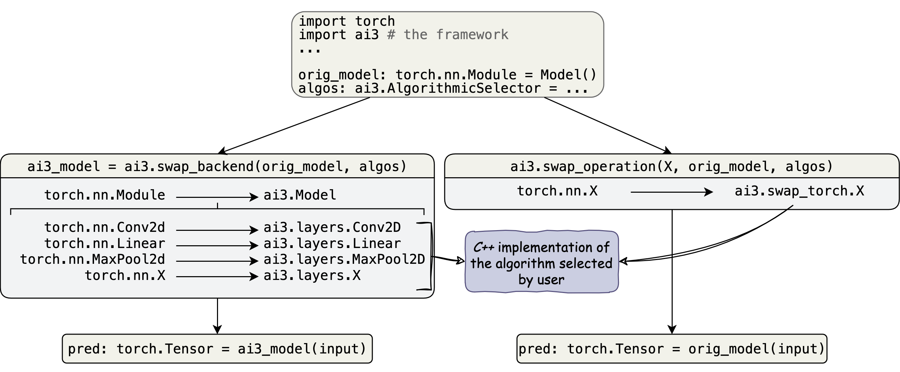

# Summary

*ai3*, initially proposed in [@initial_proposal], is an open source framework
providing fine grain algorithmic control over an existing deep neural network (*DNN*) in both its
training and inference stage. *ai3* provides high performance, accelerated
*C++* implementations of various algorithms to complete common deep learning
operations. Additionally, *ai3*, enables users to implement their own *C++*
implementations which are included in the package upon installation. Both the
user defined and builtin implementations can be selected to complete the
operations making up a *DNN*. Selection and altering of the *DNN* is done via
an easy to use *Python* interface \ref{lst:example}. *ai3*, is an abbreviation
of algorithmic innovations for accelerated implementations of artificial
intelligence, reflecting the accelerated implementations provided by and the
potential for algorithmic innovations when using the framework.

# Statement of Need

*DNNs* have demonstrated significant success across many domains. This success
has been accompanied by substantial improvements to the algorithms used to
perform the operations forming the *DNN*. However, the most efficient algorithm
for any given operation of a *DNN* depends on a high number of factors such as
the use case of the *DNN*, input size, operation hyper-parameters and hardware
available. Due to this, discovering the best performing algorithm is a
difficult and time consuming task. Additionally, altering the algorithms in use
by a *DNN* is a difficult task requiring requiring algorithm development and
hardware mapping expertise. This makes such exploration and its benefit of
improved performance inaccessible to a significant portion of users who come
from scientific and engineering domains but may not be experts in computer
science.

# Framework Overview

The framework provides two functions to perform algorithmic selection and
swapping. One function creates a new equivalent *DNN* with all operations from the
original *DNN* converted to the frameworks implementations of the selected
algorithms. The second function swaps, in place, a specific operation out of
the existing *DNN* for the frameworks implementation of the selected algorithm.
The function which swaps a specific operation attempts to make the new
operation integrate well with the *DNNs* original framework. For example, after
swapping the operations within a *DNN* built with *PyTorch* [@pytorch2], the
*DNN* can still be trained and compiled for execution in *PyTorch's* graph
mode. Both of these functions are illustrated in figure \ref{fig:overview}.

Both of these functions have an optional parameter for the algorithmic
selector, if none is passed then a default algorithm is selected by the
framework. The function converting every operation receives a mapping from
operation type to the selector and the function swapping one operation receives
a single algorithmic selector for the operation being swapped. There are
multiple types of algorithmic selectors. Possible options include a single
algorithm which is used for all instances of the operation or a list of
algorithms where each operation uses the algorithm with the same index as that
operation has relative to other operations of the same type. Another option is a
function which returns the algorithm to use. The function is called by the
framework with the original operation as the parameter, the function will also
be passed the input shape if an input shape is provided to the function
providing the algorithmic selection.

# Code Example

This example demonstrates use of both of functions on a *VGG-16* model provided
by the *torchvision* [@torchvision] package. In the call to `convert`, a mapping
is passed from operation to algorithmic selector. When performing the swaps
for convolution, the operation and the shape of the input to that operation are
passed to a function which analyzes those parameters and returns the algorithm
to use. For all other operations the algorithm used is the default provided by
the framework. In the `swap_operation` call, the `torch.nn.Conv2d` type is passed to
swap out convolutional layers, a list of $16$ elements alternating between ``direct``
and ``SMM`` [@smm] is passed meaning the $16$ convolution layers alternate between
the ``direct`` and ``SMM`` algorithms to perform the convolutions.

\lstinputlisting[label={lst:example}, caption={Use of Both Functions}]{example.py}

# Acknowledgements

This work is sponsored by the *U.S.* National Science Foundation under award
numbers $2117439$, $2411447$, and $2425535$.

# References
